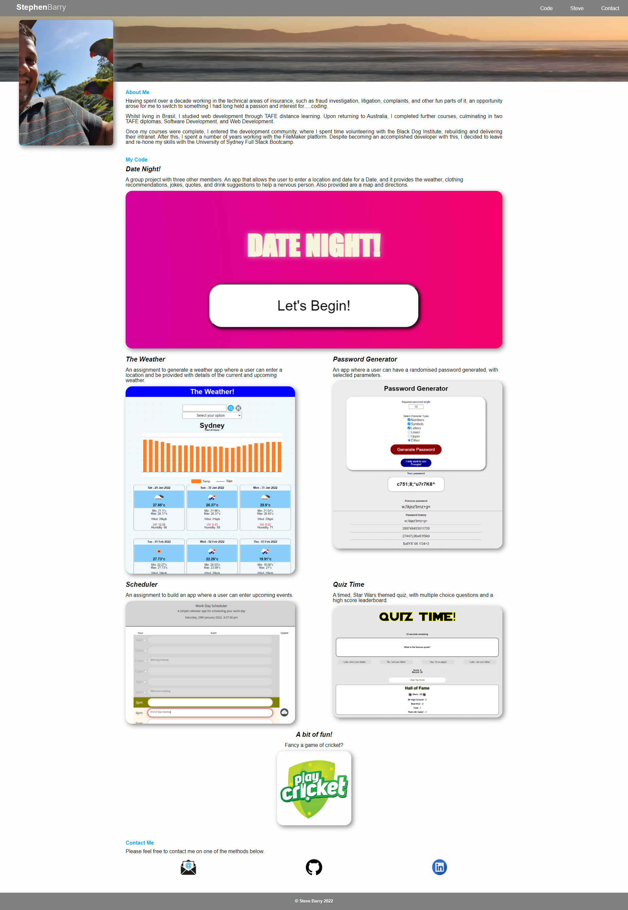

## Portfolio - Steve Barry

##  The Task

The task was to update our portfolio from Week 2 to include our group project, more recent examples, and a refreshed look, together with updated resume/LinkedIn/Github.

### ⭐ ⭐ S.T.A.R. ⭐ ⭐

**SITUATION**

The provided user story was: 

> AS A coding boot camp student
> 
> I WANT to take a timed quiz on JavaScript fundamentals that stores high scores
>
> SO THAT I can gauge my progress compared to my peers

**TASK**

Provide a solution that asks a number of questions, against a timer, and then record the score and compare to other scores.

*Having checked with the teachers, it was confirmed that the topic of questions does not necessarily need to be on Javascript*

**ACTION**

Writing of a solution to resolve the situation, including:
* Layout
  * *Layout is responsive and functional on various screen sizes*
  * *Simple, yet attractive design*
  * *Logical layout*
  * *Improved code visualisation - eg: indentation*
  * *Error free loading*
  * *Favicon designed and added*
  * *Thorough comments*
  * *Intuitive design with messages to users*
* Javascript
  * *Error free performance*
  * *Multiple functions to separate aspects of code*
  * *Thorough comments*
* GIT
  * *Numerous commits to track changes in code*
  * *Code added to public repository and Github Pages for public viewing*
* Functionality
  * *Feedback to the user as to how well they've done, with a Star Wars twist*
  * *Hall of Fame to track the best scores, which can be cleared if desired*

**RESULT**

The end code is stored on Github, and publicly available and viewable. This result meets all requirements of the User Story and acceptance criteria:

##  The Outcome

As the acceptance criteria has been met and exceeded, the task is now complete. 

You can view the finished product [HERE](https://nbs5000.github.io/portfolio_2/)

Alternatively, here is a screenshot:

> 

---

Written by Steve Barry - Due date 31/1/2022

© 2022 Trilogy Education Services, LLC, a 2U, Inc. brand. Confidential and Proprietary. All Rights Reserved.

